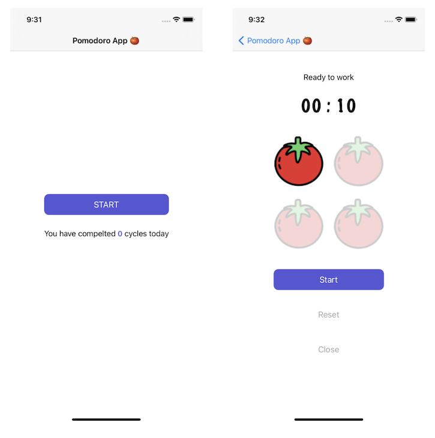

# Pomodoro App 🍅

Starter project to demonstrate the use of communication patterns.

**Instructions:**

Download the starter app that serves as a time tracker for the Pomodoro technique. Your task is to complete it by adding the functionality of buttons and the timer. You can find all the places where code is needed with `TODO:` marks in the source code.

**Expected behavior:**

- Every time the user completes a cycle of 4 Pomodoros, use a notification to update the count in the home screen.
- When the user leaves the timer screen they should see how many cycles they completed for the day.

